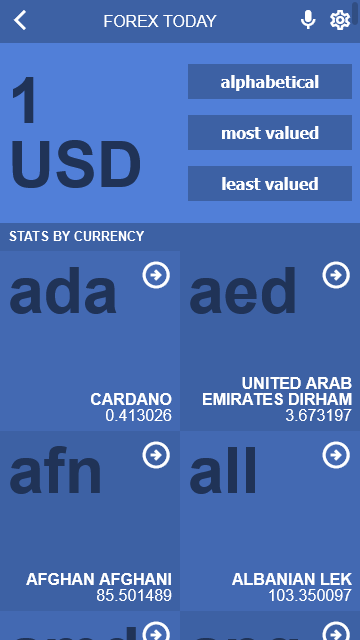

# Currency

> Microverse's React capstone project




A mobile web single-page application to check the daily exchange rate of the world's currencies. It makes use of React, Redux, and a currency API.

## Built With

- HTML & CSS
- JavaScript
- React
- Redux
- API

## Live Demo

Check out a live demo of this project by [clicking here.](https://currency-x.netlify.app/)


## Getting Started

To get a local copy up and running follow these steps.


### Prerequisites

- [npm](https://docs.npmjs.com/downloading-and-installing-node-js-and-npm)

### Setup

1. Download or clone the repository's contents.
2. Go to the project's root directory.
```
cd currency
```
3. Install all the dependencies:
```
npm install
```

### Install

You can either build a local production version of the project or open it directly on a server in development mode.

  #### Build

  1. To build and open a production version of the app run the command:
  ```
  npm run build
  ```
  2. Then open *dist/index.html* in you preferred browser.

  #### Start Development Server

  1. To open the app in development mode on *dev-server* run:
  ```
  npm start
  ```
  2. Then go to `http://localhost:3000/` in you preferred browser.

  #### Build

  1. To build and open a production version of the app run the command:
  ```
  npm run build
  ```
  2. Then open *dist/index.html* in you preferred browser.

  #### Start Development Server

  1. To open the app in development mode on *dev-server* run:
  ```
  npm start
  ```
  2. Then go to `http://localhost:8080/` in you preferred browser.

## Author

👨‍💻 **Breno Xavier**

- GitHub: [@brenoxav](https://github.com/brenoxav)
- LinkedIn: [Breno Xavier](https://linkedin.com/in/brenoxav)

## 🤝 Contributing

Contributions, issues, and feature requests are welcome!

Feel free to check the [issues page](https://github.com/brenoxav/currency/issues).

## Show your support

Give a ⭐️ if you like this project!

## Acknowledgments

- Microverse
- [Nelson Sakwa](https://www.behance.net/sakwadesignstudio) - [Design idea](https://www.behance.net/gallery/31579789/Ballhead-App-(Free-PSDs))
- [Fawaz Ahmed](https://github.com/fawazahmed0) - [Currency API](https://github.com/fawazahmed0/currency-api)
